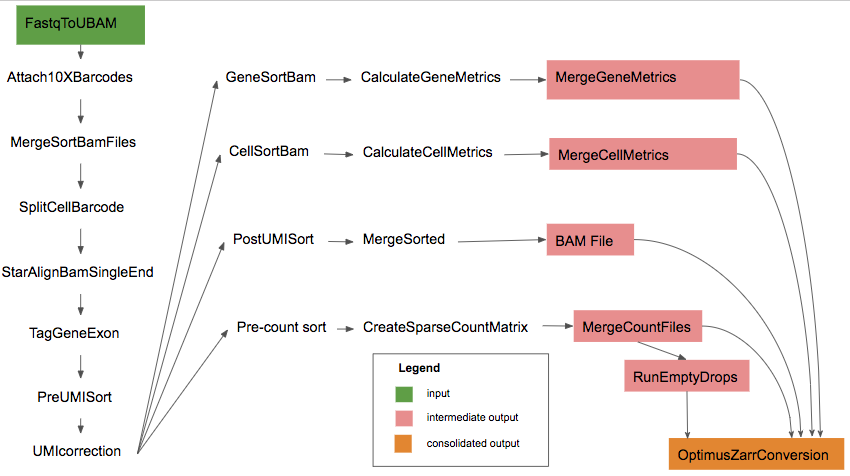

# Optimus Pipeline Overview

The Optimus pipeline is a pipeline for processing 3' single-cell expression data generated with the 10X Genomic V2 assay, developed by the Data Coordination Platform (DCP) of the Human Cell Atlas (HCA) Project. 

Optimus is a alignment and transcriptome quantification pipeline. Optimus corrects Cell Barcodes (CBs) and Unique Molecular Identifiers (UMIs), aligns reads to the genome, generates an expression count matrix in a UMI-aware manner, detects empty droplets, calculates summary statistics for genes and cells, and returns read outputs in BAM format and expression counts in numpy matrix and Zarr file formats. Special care is taken to keep all reads that may be useful to the downstream user, such as unaligned reads or reads with uncorrectable barcodes. This design provides flexibility to the downstream user and allows for alternative filtering or leveraging the data for novel methodological development.

More details can be found in the [Optimus Acceptance Report](https://docs.google.com/document/d/158ba_xQM9AYyu8VcLWsIvSoEYps6PQhgddTr9H0BFmY/edit)

### Installation  
The Optimus pipeline code can be downloaded by cloning the github repository [Skylab](https://github.com/HumanCellAtlas/skylab/). For the latest release of Optimus please see the realease tags prefixed with "optimus" [here](https://github.com/HumanCellAtlas/skylab/releases)

### Requirements  
Optimus can be deployed using [Cromwell](https://software.broadinstitute.org/wdl/), a GA4GH compliant, flexible workflow management system that supports multiple computing platforms. Optimus can also be run in [Terra](https://app.terra.bio/#workspaces/help-gatk/HCA_Optimus_Pipeline), a cloud-based analysis platform. In this featured workspace the user will find the Optimus pipeline, configurations, required reference data and other inputs, and example testing data.

### Running Optimus
* [Optimus.wdl](https://github.com/HumanCellAtlas/skylab/blob/master/pipelines/optimus/Optimus.wdl) in the pipelines/optimus folder,  of the repository, implements the workflow by importing individual tasks in task based WDLs in skylab/library.

#### Inputs
Example input file locations are specified in a json file, e.g., [here](https://github.com/HumanCellAtlas/skylab/blob/master/pipelines/optimus/example_test_inputs.json).

#### Outputs
The outputs from the Optimus pipeline can be identified from the outputs of the individual tasks, e.g. [here](https://github.com/HumanCellAtlas/skylab/blob/master/pipelines/optimus/example_test_outputs.json)

Following are the the types of files produced from the pipeline.

| file type | Description |
| --- | --- |
| pipeline_version | Version of the pipeline |
| bam | Merged and Sorted BAM file |
| matrix |  Sparse count matrix in numpy format |
| matrix_row_index | Sparse count matrix row names in numpy format |
| matrix_col_index | Sparse count matrix col names in numpy format |
| cell_metrics | Cell metrics table in text format |
| gene_metrics | Gene metrics table in text format |
| cell_calls | Cell metadata from emptyDrops |
| zarr_outputs_file | Count matrix and cell and gene metrics in zarr format|

### Components of Optimus
The source code is available from [Github](https://github.com/HumanCellAtlas/skylab/blob/master/pipelines/optimus/Optimus.wdl), an overview of the pipeline can be found on the [HCA Data Portal](https://prod.data.humancellatlas.org/) and the benchmarking that was performed on the pipeline can be found [here](https://docs.google.com/document/d/158ba_xQM9AYyu8VcLWsIvSoEYps6PQhgddTr9H0BFmY/edit#heading=h.calfpviouwbg). Some of the tasks in Optimus use the [sctools](https://github.com/HumanCellAtlas/sctools) library of utilities for large scale distributed single cell data processing, and [Picard](https://broadinstitute.github.io/picard/) tools, a set of command line tools for manipulating high-throughput sequencing data in formats such as SAM/BAM/CRAM and VCF.
