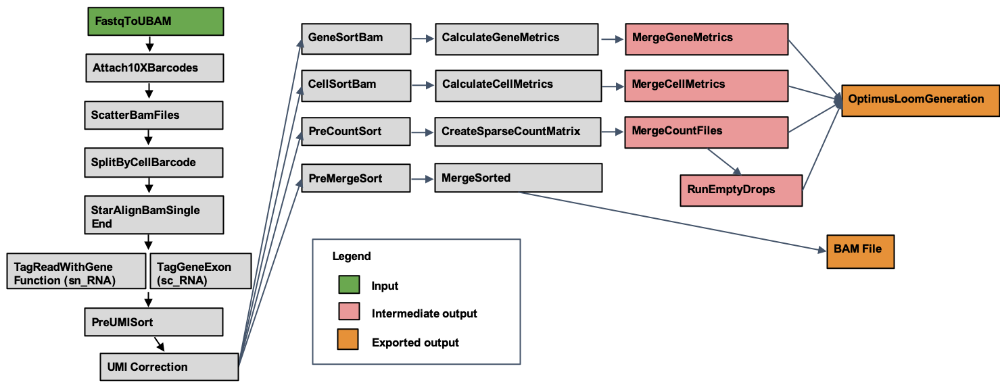

# Table of Contents
- [Optimus Pipeline Overview](#optimus-pipeline-overview)
  * [Introduction to the Optimus Workflow](#introduction-to-the-optimus-workflow)
  * [Quick Start Table](#quick-start-table)
- [Set-up](#set-up)
  * [Optimus Installation and Requirements](#optimus-installation-and-requirements)
  * [Inputs](#inputs)
    + [Sample Data Input](#sample-data-input)
    + [Additional Reference Inputs](#additional-reference-inputs)
- [Running Optimus](#running-optimus)
  * [Optimus Modules Summary](#optimus-modules-summary)
    + [1. Converting R2 Fastq File to UBAM](#1-converting-r2-fastq-file-to-ubam)
    + [2. Correcting and Attaching Cell Barcodes](#2-correcting-and-attaching-cell-barcodes)
    + [3. Alignment](#3-alignment)
    + [4. Gene Annotation](#4-gene-annotation)
    + [5. UMI Correction](#5-umi-correction)
    + [6. Identification of Empty Droplets](#6-identification-of-empty-droplets)
    + [7. Metric Calculation](#7-metric-calculation)
    + [8. Count Matrix Construction](#8-count-matrix-construction)
    + [9. Outputs](#9-outputs)
- [Versioning](#versioning)
- [Additional Notes](#additional-notes)

# Optimus Pipeline Overview

## Introduction to the Optimus Workflow

Optimus is a pipeline developed by the Data Coordination Platform (DCP) of the [Human Cell Atlas (HCA) Project](https://data.humancellatlas.org/) that supports processing of any 3' single-cell expression data generated with the [10X Genomic V2 and V3 assay](https://www.10xgenomics.com/solutions/single-cell/). It is an alignment and transcriptome quantification pipeline that corrects Cell Barcodes, aligns reads to the genome, corrects Unique Molecular Identifiers (UMIs), generates an expression matrix in a UMI-aware manner, detects empty droplets, calculates summary metrics for genes and cells, returns read outputs in BAM format, and returns cell gene expression in numpy matrix, Zarr, and Loom file formats. Special care is taken to keep all reads that may be useful to the downstream user, such as unaligned reads or reads with uncorrectable barcodes. This design provides flexibility to the downstream user and allows for alternative filtering or leveraging the data for novel methodological development.

Optimus has been validated for analyzing both [human](../../benchmarking/optimus/optimus_report.rst) and [mouse](https://docs.google.com/document/d/1_3oO0ZQSrwEoe6D3GgKdSmAQ9qkzH_7wrE7x6_deL10/edit) data sets. More details about the human validation can be found in the [in the original file](https://docs.google.com/document/d/158ba_xQM9AYyu8VcLWsIvSoEYps6PQhgddTr9H0BFmY/edit).

## Quick Start Table

| Pipeline Features | Description | Source |
|-------------------|---------------------------------------------------------------|-----------------------|
| Assay Type | 10x Single Cell Expression (v2 and v3) | [10x Genomics](https://www.10xgenomics.com)
| Overall Workflow  | Quality control module and transcriptome quantification module | Code available from [Github](https://github.com/HumanCellAtlas/skylab/blob/master/pipelines/optimus/Optimus.wdl) |
| Workflow Language | WDL          | [openWDL](https://github.com/openwdl/wdl) |
| Genomic Reference Sequence|GRCh38 human genome primary sequence and M21 (GRCm38.p6) mouse genome primary sequence|GENCODE [Human](https://www.gencodegenes.org/human/release_27.html) and [Mouse](https://www.gencodegenes.org/mouse/release_M21.html) 
| Transcriptomic Reference Annotation | V27 GenCode human transcriptome and M21 mouse transcriptome | GENCODE [Human](ftp://ftp.ebi.ac.uk/pub/databases/gencode/Gencode_human/release_27/gencode.v27.annotation.gtf.gz) and [Mouse](ftp://ftp.ebi.ac.uk/pub/databases/gencode/Gencode_mouse/release_M21/gencode.vM21.annotation.gff3.gz) |
| Aligner           | STAR (v.2.5.3)       | [Dobin, et al.,2013](https://www.ncbi.nlm.nih.gov/pmc/articles/PMC3530905/) |
| Transcript Quantification | Utilities for processing large-scale single cell datasets | [Sctools](https://github.com/HumanCellAtlas/sctools)                          
| Data Input File Format | File format in which sequencing data is provided | [FASTQ](https://academic.oup.com/nar/article/38/6/1767/3112533) |                     
| Data Output File Format | File formats in which Optimus output is provided | [BAM](http://samtools.github.io/hts-specs/), [Zarr version 2](https://zarr.readthedocs.io/en/stable/spec/v2.html), Python numpy arrays (internal), Loom (generated with [Loompy v.3.0)](http://loompy.org/) |

# Set-up

## Optimus Installation and Requirements
The Optimus pipeline code can be downloaded by cloning the GitHub repository [Skylab](https://github.com/HumanCellAtlas/skylab/). For the latest release of Optimus, please see the realease tags prefixed with "optimus" [here](https://github.com/HumanCellAtlas/skylab/releases). 

Optimus can be deployed using [Cromwell](https://software.broadinstitute.org/wdl/), a GA4GH compliant, flexible workflow management system that supports multiple computing platforms. Optimus can also be run in [Terra](https://app.terra.bio/#workspaces/help-gatk/HCA_Optimus_Pipeline), a cloud-based analysis platform. In this featured workspace the user will find the Optimus pipeline, configurations, required reference data and other inputs, and example testing data.

## Inputs

Optimus pipeline inputs are detailed in a json file, such as in this [example](https://github.com/HumanCellAtlas/skylab/blob/master/pipelines/optimus/example_test_inputs.json). 

### Sample Data Input

Each 10X v2 and v3 3’ sequencing experiment generates triplets of fastq files for any given sample:  

1. A forward reads (r1_fastq), containing the unique molecular identifier (UMI) and cell barcode sequences
2. A reverse reads (r2_fastq), which contain the alignable genomic information from the mRNA transcript 
3. An index fastq (i1_fastq) that contains the sample barcodes, when provided by the sequencing facility

Note: Optimus is currently a single sample pipeline, but can take in multiple sets of fastqs for a sample that has been split over lanes of sequencing. 

### Additional Reference Inputs

The json file also contains metadata for the following reference information:

* Whitelist: a list of known cell barcodes from [10X genomics](https://www.10xgenomics.com/)
* Tar_star_reference: TAR file containing a specifes-specific reference genome and gtf; it is generated using the [StarMkRef.wdl](https://github.com/HumanCellAtlas/skylab/blob/master/library/tasks/StarMkref.wdl)
* Sample_id: a unique name describing the biological sample or replicate that corresponds with the original fastq files
* Annotations_gtf: a GTF containing gene annotations used for gene tagging (must match gft in STAR reference)
* Chemistry: an optional description of whether data was generated with V2 or V3 chemistry

# Running Optimus

* [Optimus.wdl](https://github.com/HumanCellAtlas/skylab/blob/master/pipelines/optimus/Optimus.wdl) in the pipelines/optimus folder,  of the repository, implements the workflow by importing individual tasks in task based WDLs in skylab/library.

## Optimus Modules Summary

Here we describe the modules ("tasks") of the Optimus Pipeliene; [the code](https://github.com/HumanCellAtlas/skylab/blob/master/pipelines/optimus/Optimus.wdl) and [library of tasks](https://github.com/HumanCellAtlas/skylab/tree/master/library/tasks) are available through Github.

Overall, the workflow:
1. Converts R2 fastq file (containing alignable genomic information) to an unaligend BAM (UBAM)
2. Corrects and attaches 10X Barcodes using the R1 Fastq file 
3. Aligns reads to the genome with STAR v.2.5.3a
4. Annotates genes with aligned reads
5. Corrects UMIs
6. Detects empty droplets
7. Calculates summary metrics
8. Produces a UMI-aware expression matrix
9. Returns output in BAM, Zarr, or Loom file formats

Special care is taken to flag but avoid the removal of reads that are not aligned or that do not contain recognizable barcodes. This design (which differs from many pipelines currently available) allows use of the entire dataset by those who may want to use alternative filtering or leverage the data for methodological development associated with the data processing.

### 1. Converting R2 Fastq File to UBAM

Unlike fastq files, BAM files enable researchers to keep track of important metadata throughout all data processing steps. The first step of Optimus is to [convert](https://github.com/HumanCellAtlas/skylab/blob/master/library/tasks/FastqToUBam.wdl) the R2 fastq file, containing the alignable genomic information, to an unaligned BAM (UBAM) file.

### 2. Correcting and Attaching Cell Barcodes

Although the function of the cell barcodes is to identify unique cells, barcode errors can arise during sequencing (such as incorporation of the barcode into contaminating DNA or sequencing and PCR errors), making it difficult to distinguish unique cells from artifactual appearances of the barcode. The [Attach10xBarcodes](https://github.com/HumanCellAtlas/skylab/blob/master/library/tasks/Attach10xBarcodes.wdl) task evaluates barcode errors by comparing the R1 fastq sequences against a whitelist of known barcode sequences.

Next, the [Attach10xBarcodes](https://github.com/HumanCellAtlas/skylab/blob/master/library/tasks/Attach10xBarcodes.wdl) task appends the UMI and Cell Barcode sequences from the R1 fastq to the UBAM sequence as tags, properly labeling the genomic information for alignment.

The output is a UBAM file containing the reads with correct barcodes, including barcodes that came within one edit distance ([Levenshtein distance](http://www.levenshtein.net/)) of matching the whitelist of barcode sequences and were corrected by this tool. Correct barcodes are assigned a “CB” tag. Uncorrectable barcodes (with more than one error) are preserved and given a “CR” (Cell barcode Raw) tag. Cell barcode quality scores are also preserved in the file under the “CY” tag.

To facilitate subsequent processing steps, the pipeline then [scatters](https://github.com/HumanCellAtlas/skylab/blob/master/library/tasks/ScatterBam.wdl) and [splits](https://github.com/HumanCellAtlas/skylab/blob/master/library/tasks/SplitBamByCellBarcode.wdl) the corrected UBAM files into groups according to cell barcode. 

### 3. Alignment

Optimus uses the [STAR alignment](https://github.com/HumanCellAtlas/skylab/blob/master/library/tasks/StarAlignBamSingleEnd.wdl) task to map barcoded reads in the UBAM file to the genome primary assembly reference (see table above for version information). This task uses STAR (Spliced Transcripts Alignment to a Reference; [Dobin, et al., 2013](https://www.ncbi.nlm.nih.gov/pmc/articles/PMC3530905/) a standard, splice-aware, RNA-seq alignment tool.

### 4. Gene Annotation

The [TagGeneExon](https://github.com/HumanCellAtlas/skylab/blob/master/library/tasks/TagGeneExon.wdl) task then annotates each read with the type of sequence to which it aligns. These annotations include INTERGENIC, INTRONIC, and EXONIC, and are stored using the XF BAM tag. In cases where the gene corresponds to an intron or exon, the name of the gene that overlaps the alignment is associated with the read and stored using the GE BAM tag.

### 5. UMI Correction

UMIs are designed to distinguish unique transcripts present in the cell at lysis from those arising from PCR amplification of these same transcripts. But, like cell barcodes, UMIs can also be incorrectly sequenced or amplified. Optimus uses the [UmiCorrection task](https://github.com/HumanCellAtlas/skylab/blob/master/library/tasks/UmiCorrection.wdl) to apply a network-based, "directional" method ([Smith, et al., 2017](https://www.ncbi.nlm.nih.gov/pmc/articles/PMC5340976/)) to account for such errors. 

### 6. Identification of Empty Droplets

In addition, the pipeline runs the EmptyDrops function from the [dropletUtils](http://bioconductor.org/packages/release/bioc/html/DropletUtils.html) R package to identify cell barcodes that correspond to empty droplets. Empty droplets are those that did not encapsulate a cell but instead acquired cell-free RNA from the solution in which the cells resided -- such as secreted RNA or RNA released when some cells lysed in solution ([Lun, et al., 2018](https://www.ncbi.nlm.nih.gov/pubmed/?term=30902100)). This ambient RNA can serve as a substrate for reverse transcription, leading to a small number of background reads. Cell barcodes that are not believed to represent cells are identified in the metrics and raw information from dropletUtils is provided to the user.

### 7. Metric Calculation

A number of [quality control tools](https://github.com/HumanCellAtlas/sctools) are used to assess the quality of the data output each time this pipeline is run. For a list of the tools and information about each one please see our [QC Metrics](/pipelines/hca-pipelines/data-processing-pipelines/qc-metrics) page. These metrics are included in ZARR and Loom output files.

| Cell Metrics                      | Program            |Details                 |
|-----------------------------------|--------------------|------------------------|
|`n_reads`|[SC Tools](https://github.com/HumanCellAtlas/sctools/tree/master/src/sctools/metrics)|The number of reads associated with this entity. [Metrics Definitions](https://sctools.readthedocs.io/en/latest/sctools.metrics.html#sctools.metrics.aggregator.CellMetrics.n_reads)|
|`noise_reads`|[SC Tools](https://github.com/HumanCellAtlas/sctools/tree/master/src/sctools/metrics)|Number of reads that are categorized by 10x Genomics Cell Ranger as "noise". Refers to long polymers, or reads with high numbers of N (ambiguous) nucleotides. [Metrics Definitions](https://sctools.readthedocs.io/en/latest/sctools.metrics.html#sctools.metrics.aggregator.CellMetrics.noise_reads)|
|`perfect_molecule_barcodes`|[SC Tools](https://github.com/HumanCellAtlas/sctools/tree/master/src/sctools/metrics)|The number of reads with molecule barcodes that have no errors. [Metrics Definitions](https://sctools.readthedocs.io/en/latest/sctools.metrics.html#sctools.metrics.aggregator.CellMetrics.perfect_molecule_barcodes)|
|`reads_mapped_exonic`|[SC Tools](https://github.com/HumanCellAtlas/sctools/tree/master/src/sctools/metrics)|The number of reads for this entity that are mapped to exons. [Metrics Definitions](https://sctools.readthedocs.io/en/latest/sctools.metrics.html#sctools.metrics.aggregator.CellMetrics.reads_mapped_exonic)|
|`reads_mapped_intronic`|[SC Tools](https://github.com/HumanCellAtlas/sctools/tree/master/src/sctools/metrics)|The number of reads for this entity that are mapped to introns. [Metrics Definitions](https://sctools.readthedocs.io/en/latest/sctools.metrics.html#sctools.metrics.aggregator.CellMetrics.reads_mapped_intronic)|
|`reads_mapped_utr`|[SC Tools](https://github.com/HumanCellAtlas/sctools/tree/master/src/sctools/metrics)|The number of reads for this entity that are mapped to 3' untranslated regions (UTRs). [Metrics Definitions](https://sctools.readthedocs.io/en/latest/sctools.metrics.html#sctools.metrics.aggregator.CellMetrics.reads_mapped_utr)|
|`reads_mapped_uniquely`|[SC Tools](https://github.com/HumanCellAtlas/sctools/tree/master/src/sctools/metrics)|The number of reads mapped to a single unambiguous location in the genome. [Metrics Definitions](https://sctools.readthedocs.io/en/latest/sctools.metrics.html#sctools.metrics.aggregator.CellMetrics.reads_mapped_uniquely)|
|`reads_mapped_multiple`|[SC Tools](https://github.com/HumanCellAtlas/sctools/tree/master/src/sctools/metrics)|The number of reads mapped to multiple genomic positions with equal confidence. [Metrics Definitions](https://sctools.readthedocs.io/en/latest/sctools.metrics.html#sctools.metrics.aggregator.CellMetrics.reads_mapped_multiple)|
|`duplicate_reads`|[SC Tools](https://github.com/HumanCellAtlas/sctools/tree/master/src/sctools/metrics)|The number of reads that are duplicates (see README.md for definition of a duplicate). [Metrics Definitions](https://sctools.readthedocs.io/en/latest/sctools.metrics.html#sctools.metrics.aggregator.CellMetrics.duplicate_reads)|
|`spliced_reads`|[SC Tools](https://github.com/HumanCellAtlas/sctools/tree/master/src/sctools/metrics)|The number of reads that overlap splicing junctions. [Metrics Definitions](https://sctools.readthedocs.io/en/latest/sctools.metrics.html#sctools.metrics.aggregator.CellMetrics.spliced_reads)|
|`antisense_reads`|[SC Tools](https://github.com/HumanCellAtlas/sctools/tree/master/src/sctools/metrics)|The number of reads that are mapped to the antisense strand instead of the transcribed strand. [Metrics Definitions](https://sctools.readthedocs.io/en/latest/sctools.metrics.html#sctools.metrics.aggregator.CellMetrics.antisense_reads)|
|`molecule_barcode_fraction_bases_above_30_mean`|[SC Tools](https://github.com/HumanCellAtlas/sctools/tree/master/src/sctools/metrics)|The average fraction of bases in molecule barcodes that receive quality scores greater than 30 across the reads of this entity. [Metrics Definitions](https://sctools.readthedocs.io/en/latest/sctools.metrics.html#sctools.metrics.aggregator.CellMetrics.molecule_barcode_fraction_bases_above_30_mean)|
|`molecule_barcode_fraction_bases_above_30_variance`|[SC Tools](https://github.com/HumanCellAtlas/sctools/tree/master/src/sctools/metrics)|The variance in the fraction of bases in molecule barcodes that receive quality scores greater than 30 across the reads of this entity. [Metrics Definitions](https://sctools.readthedocs.io/en/latest/sctools.metrics.html#sctools.metrics.aggregator.CellMetrics.molecule_barcode_fraction_bases_above_30_variance)|
|`genomic_reads_fraction_bases_quality_above_30_mean`|[SC Tools](https://github.com/HumanCellAtlas/sctools/tree/master/src/sctools/metrics)|The average fraction of bases in the genomic read that receive quality scores greater than 30 across the reads of this entity (included for 10x Cell Ranger count comparison). [Metrics Definitions](https://sctools.readthedocs.io/en/latest/sctools.metrics.html#sctools.metrics.aggregator.CellMetrics.genomic_reads_fraction_bases_quality_above_30_mean)|
|`genomic_reads_fraction_bases_quality_above_30_variance`|[SC Tools](https://github.com/HumanCellAtlas/sctools/tree/master/src/sctools/metrics)|The variance in the fraction of bases in the genomic read that receive quality scores greater than 30 across the reads of this entity (included for 10x Cell Ranger count comparison). [Metrics Definitions](https://sctools.readthedocs.io/en/latest/sctools.metrics.html#sctools.metrics.aggregator.CellMetrics.genomic_reads_fraction_bases_quality_above_30_variance)|
|`genomic_read_quality_mean`|[SC Tools](https://github.com/HumanCellAtlas/sctools/tree/master/src/sctools/metrics)|Average quality of Illumina base calls in the genomic reads corresponding to this entity. [Metrics Definitions](https://sctools.readthedocs.io/en/latest/sctools.metrics.html#sctools.metrics.aggregator.CellMetrics.genomic_read_quality_mean)|
|`genomic_read_quality_variance`|[SC Tools](https://github.com/HumanCellAtlas/sctools/tree/master/src/sctools/metrics)|Variance in quality of Illumina base calls in the genomic reads corresponding to this entity. [Metrics Definitions](https://sctools.readthedocs.io/en/latest/sctools.metrics.html#sctools.metrics.aggregator.CellMetrics.genomic_read_quality_variance)|
|`n_molecules`|[SC Tools](https://github.com/HumanCellAtlas/sctools/tree/master/src/sctools/metrics)|Number of molecules corresponding to this entity. See README.md for the definition of a Molecule. [Metrics Definitions](https://sctools.readthedocs.io/en/latest/sctools.metrics.html#sctools.metrics.aggregator.CellMetrics.n_molecules)|
|`n_fragments`|[SC Tools](https://github.com/HumanCellAtlas/sctools/tree/master/src/sctools/metrics)|Number of fragments corresponding to this entity. See README.md for the definition of a Fragment. [Metrics Definitions](https://sctools.readthedocs.io/en/latest/sctools.metrics.html#sctools.metrics.aggregator.CellMetrics.n_fragments)|
|`reads_per_molecule`|[SC Tools](https://github.com/HumanCellAtlas/sctools/tree/master/src/sctools/metrics)|The average number of reads associated with each molecule in this entity. [Metrics Definitions](https://sctools.readthedocs.io/en/latest/sctools.metrics.html#sctools.metrics.aggregator.CellMetrics.reads_per_molecule)|
|`reads_per_fragment`|[SC Tools](https://github.com/HumanCellAtlas/sctools/tree/master/src/sctools/metrics)|The average number of reads associated with each fragment in this entity. [Metrics Definitions](https://sctools.readthedocs.io/en/latest/sctools.metrics.html#sctools.metrics.aggregator.CellMetrics.reads_per_fragment)|
|`fragments_per_molecule`|[SC Tools](https://github.com/HumanCellAtlas/sctools/tree/master/src/sctools/metrics)|The average number of fragments associated with each molecule in this entity. [Metrics Definitions](https://sctools.readthedocs.io/en/latest/sctools.metrics.html#sctools.metrics.aggregator.CellMetrics.fragments_per_molecule)|
|`fragments_with_single_read_evidence`|[SC Tools](https://github.com/HumanCellAtlas/sctools/tree/master/src/sctools/metrics)|The number of fragments associated with this entity that are observed by only one read. [Metrics Definitions](https://sctools.readthedocs.io/en/latest/sctools.metrics.html#sctools.metrics.aggregator.CellMetrics.fragments_with_single_read_evidence)|
|`molecules_with_single_read_evidence`|[SC Tools](https://github.com/HumanCellAtlas/sctools/tree/master/src/sctools/metrics)|The number of molecules associated with this entity that are observed by only one read. [Metrics Definitions](https://sctools.readthedocs.io/en/latest/sctools.metrics.html#sctools.metrics.aggregator.CellMetrics.molecules_with_single_read_evidence)|
|`perfect_cell_barcodes`|[SC Tools](https://github.com/HumanCellAtlas/sctools/tree/master/src/sctools/metrics)|The number of reads whose cell barcodes contain no error. [Metrics Definitions](https://sctools.readthedocs.io/en/latest/sctools.metrics.html#sctools.metrics.aggregator.CellMetrics.perfect_cell_barcodes)|
|`reads_mapped_intergenic`|[SC Tools](https://github.com/HumanCellAtlas/sctools/tree/master/src/sctools/metrics)|The number of reads mapped to an intergenic region for this cell. [Metrics Definitions](https://sctools.readthedocs.io/en/latest/sctools.metrics.html#sctools.metrics.aggregator.CellMetrics.reads_mapped_intergenic)|
|`reads_mapped_too_many_loci`|[SC Tools](https://github.com/HumanCellAtlas/sctools/tree/master/src/sctools/metrics)|The number of reads that were mapped to too many loci across the genome and as a consequence, are reported unmapped by the aligner. [Metrics Definitions](https://sctools.readthedocs.io/en/latest/sctools.metrics.html#sctools.metrics.aggregator.CellMetrics.reads_mapped_too_many_loci)|
|`cell_barcode_fraction_bases_above_30_variance`|[SC Tools](https://github.com/HumanCellAtlas/sctools/tree/master/src/sctools/metrics)|The variance of the fraction of Illumina base calls for the cell barcode sequence that are greater than 30, across molecules. [Metrics Definitions](https://sctools.readthedocs.io/en/latest/sctools.metrics.html#sctools.metrics.aggregator.CellMetrics.cell_barcode_fraction_bases_above_30_variance)|
|`cell_barcode_fraction_bases_above_30_mean`|[SC Tools](https://github.com/HumanCellAtlas/sctools/tree/master/src/sctools/metrics)|The average fraction of Illumina base calls for the cell barcode sequence that are greater than 30, across molecules. [Metrics Definitions](https://sctools.readthedocs.io/en/latest/sctools.metrics.html#sctools.metrics.aggregator.CellMetrics.cell_barcode_fraction_bases_above_30_mean)|
|`n_genes`|[SC Tools](https://github.com/HumanCellAtlas/sctools/tree/master/src/sctools/metrics)|The number of genes detected by this cell. [Metrics Definitions](https://sctools.readthedocs.io/en/latest/sctools.metrics.html#sctools.metrics.aggregator.CellMetrics.n_genes)|
|`genes_detected_multiple_observations`|[SC Tools](https://github.com/HumanCellAtlas/sctools/tree/master/src/sctools/metrics)|The number of genes that are observed by more than one read in this cell. [Metrics Definitions](https://sctools.readthedocs.io/en/latest/sctools.metrics.html#sctools.metrics.aggregator.CellMetrics.genes_detected_multiple_observations)|

| Gene Metrics                  | Program            |Details                 | 
|-------------------------------|--------------------|------------------------|
|`n_reads`|[SC Tools](https://github.com/HumanCellAtlas/sctools/tree/master/src/sctools/metrics)|The number of reads associated with this entity. [Metrics Definitions](https://sctools.readthedocs.io/en/latest/sctools.metrics.html#sctools.metrics.aggregator.CellMetrics.n_reads)|
|`noise_reads`|[SC Tools](https://github.com/HumanCellAtlas/sctools/tree/master/src/sctools/metrics)|Number of reads that are categorized by 10x Genomics Cell Ranger as "noise". Refers to long polymers, or reads with high numbers of N (ambiguous) nucleotides. [Metrics Definitions](https://sctools.readthedocs.io/en/latest/sctools.metrics.html#sctools.metrics.aggregator.CellMetrics.noise_reads)|
|`perfect_molecule_barcodes`|[SC Tools](https://github.com/HumanCellAtlas/sctools/tree/master/src/sctools/metrics)|The number of reads with molecule barcodes that have no errors. [Metrics Definitions](https://sctools.readthedocs.io/en/latest/sctools.metrics.html#sctools.metrics.aggregator.CellMetrics.perfect_molecule_barcodes)|
|`reads_mapped_exonic`|[SC Tools](https://github.com/HumanCellAtlas/sctools/tree/master/src/sctools/metrics)|The number of reads for this entity that are mapped to exons. [Metrics Definitions](https://sctools.readthedocs.io/en/latest/sctools.metrics.html#sctools.metrics.aggregator.CellMetrics.reads_mapped_exonic)|
|`reads_mapped_intronic`|[SC Tools](https://github.com/HumanCellAtlas/sctools/tree/master/src/sctools/metrics)|The number of reads for this entity that are mapped to introns. [Metrics Definitions](https://sctools.readthedocs.io/en/latest/sctools.metrics.html#sctools.metrics.aggregator.CellMetrics.reads_mapped_intronic)|
|`reads_mapped_utr`|[SC Tools](https://github.com/HumanCellAtlas/sctools/tree/master/src/sctools/metrics)|The number of reads for this entity that are mapped to 3' untranslated regions (UTRs). [Metrics Definitions](https://sctools.readthedocs.io/en/latest/sctools.metrics.html#sctools.metrics.aggregator.CellMetrics.reads_mapped_utr)|
|`reads_mapped_uniquely`|[SC Tools](https://github.com/HumanCellAtlas/sctools/tree/master/src/sctools/metrics)|The number of reads mapped to a single unambiguous location in the genome. [Metrics Definitions](https://sctools.readthedocs.io/en/latest/sctools.metrics.html#sctools.metrics.aggregator.CellMetrics.reads_mapped_uniquely)|
|`reads_mapped_multiple`|[SC Tools](https://github.com/HumanCellAtlas/sctools/tree/master/src/sctools/metrics)|The number of reads mapped to multiple genomic positions with equal confidence. [Metrics Definitions](https://sctools.readthedocs.io/en/latest/sctools.metrics.html#sctools.metrics.aggregator.CellMetrics.reads_mapped_multiple)|
|`duplicate_reads`|[SC Tools](https://github.com/HumanCellAtlas/sctools/tree/master/src/sctools/metrics)|The number of reads that are duplicates (see README.md for definition of a duplicate).  [Metrics Definitions](https://sctools.readthedocs.io/en/latest/sctools.metrics.html#sctools.metrics.aggregator.CellMetrics.duplicate_reads)|
|`spliced_reads`|[SC Tools](https://github.com/HumanCellAtlas/sctools/tree/master/src/sctools/metrics)|The number of reads that overlap splicing junctions. [Metrics Definitions](https://sctools.readthedocs.io/en/latest/sctools.metrics.html#sctools.metrics.aggregator.CellMetrics.spliced_reads)|
|`antisense_reads`|[SC Tools](https://github.com/HumanCellAtlas/sctools/tree/master/src/sctools/metrics)|The number of reads that are mapped to the antisense strand instead of the transcribed strand. [Metrics Definitions](https://sctools.readthedocs.io/en/latest/sctools.metrics.html#sctools.metrics.aggregator.CellMetrics.antisense_reads)|
|`molecule_barcode_fraction_bases_above_30_mean`|[SC Tools](https://github.com/HumanCellAtlas/sctools/tree/master/src/sctools/metrics)|The average fraction of bases in molecule barcodes that receive quality scores greater than 30 across the reads of this entity. [Metrics Definitions](https://sctools.readthedocs.io/en/latest/sctools.metrics.html#sctools.metrics.aggregator.CellMetrics.molecule_barcode_fraction_bases_above_30_mean)|
|`molecule_barcode_fraction_bases_above_30_variance`|[SC Tools](https://github.com/HumanCellAtlas/sctools/tree/master/src/sctools/metrics)|The variance in the fraction of bases in molecule barcodes that receive quality scores greater than 30 across the reads of this entity. [Metrics Definitions](https://sctools.readthedocs.io/en/latest/sctools.metrics.html#sctools.metrics.aggregator.CellMetrics.molecule_barcode_fraction_bases_above_30_variance)|
|`genomic_reads_fraction_bases_quality_above_30_mean`|[SC Tools](https://github.com/HumanCellAtlas/sctools/tree/master/src/sctools/metrics)|The average fraction of bases in the genomic read that receive quality scores greater than 30 across the reads of this entity (included for 10x Cell Ranger count comparison). [Metrics Definitions](https://sctools.readthedocs.io/en/latest/sctools.metrics.html#sctools.metrics.aggregator.CellMetrics.genomic_reads_fraction_bases_quality_above_30_mean)|
|`genomic_reads_fraction_bases_quality_above_30_variance`|[SC Tools](https://github.com/HumanCellAtlas/sctools/tree/master/src/sctools/metrics)|The variance in the fraction of bases in the genomic read that receive quality scores greater than 30 across the reads of this entity (included for 10x Cell Ranger count comparison). [Metrics Definitions](https://sctools.readthedocs.io/en/latest/sctools.metrics.html#sctools.metrics.aggregator.CellMetrics.genomic_reads_fraction_bases_quality_above_30_variance)|
|`genomic_read_quality_mean`|[SC Tools](https://github.com/HumanCellAtlas/sctools/tree/master/src/sctools/metrics)|Average quality of Illumina base calls in the genomic reads corresponding to this entity. [Metrics Definitions](https://sctools.readthedocs.io/en/latest/sctools.metrics.html#sctools.metrics.aggregator.CellMetrics.genomic_read_quality_mean)|
|`genomic_read_quality_variance`|[SC Tools](https://github.com/HumanCellAtlas/sctools/tree/master/src/sctools/metrics)|Variance in quality of Illumina base calls in the genomic reads corresponding to this entity. [Metrics Definitions](https://sctools.readthedocs.io/en/latest/sctools.metrics.html#sctools.metrics.aggregator.CellMetrics.genomic_read_quality_variance)|
|`n_molecules`|[SC Tools](https://github.com/HumanCellAtlas/sctools/tree/master/src/sctools/metrics)|Number of molecules corresponding to this entity. See README.md for the definition of a Molecule. [Metrics Definitions](https://sctools.readthedocs.io/en/latest/sctools.metrics.html#sctools.metrics.aggregator.CellMetrics.n_molecules)|
|`n_fragments`|[SC Tools](https://github.com/HumanCellAtlas/sctools/tree/master/src/sctools/metrics)|Number of fragments corresponding to this entity. See README.md for the definition of a Fragment. [Metrics Definitions](https://sctools.readthedocs.io/en/latest/sctools.metrics.html#sctools.metrics.aggregator.CellMetrics.n_fragments)|
|`reads_per_molecule`|[SC Tools](https://github.com/HumanCellAtlas/sctools/tree/master/src/sctools/metrics)|The average number of reads associated with each molecule in this entity. [Metrics Definitions](https://sctools.readthedocs.io/en/latest/sctools.metrics.html#sctools.metrics.aggregator.CellMetrics.reads_per_molecule)|
|`reads_per_fragment`|[SC Tools](https://github.com/HumanCellAtlas/sctools/tree/master/src/sctools/metrics)|The average number of reads associated with each fragment in this entity. [Metrics Definitions](https://sctools.readthedocs.io/en/latest/sctools.metrics.html#sctools.metrics.aggregator.CellMetrics.reads_per_fragment)|
|`fragments_per_molecule`|[SC Tools](https://github.com/HumanCellAtlas/sctools/tree/master/src/sctools/metrics)|The average number of fragments associated with each molecule in this entity. [Metrics Definitions](https://sctools.readthedocs.io/en/latest/sctools.metrics.html#sctools.metrics.aggregator.CellMetrics.fragments_per_molecule)|
|`fragments_with_single_read_evidence`|[SC Tools](https://github.com/HumanCellAtlas/sctools/tree/master/src/sctools/metrics)|The number of fragments associated with this entity that are observed by only one read. [Metrics Definitions](https://sctools.readthedocs.io/en/latest/sctools.metrics.html#sctools.metrics.aggregator.CellMetrics.fragments_with_single_read_evidence)|
|`molecules_with_single_read_evidence`|[SC Tools](https://github.com/HumanCellAtlas/sctools/tree/master/src/sctools/metrics)|The number of molecules associated with this entity that are observed by only one read. [Metrics Definitions](https://sctools.readthedocs.io/en/latest/sctools.metrics.html#sctools.metrics.aggregator.CellMetrics.molecules_with_single_read_evidence)|
|`number_cells_detected_multiple`|[SC Tools](https://github.com/HumanCellAtlas/sctools/tree/master/src/sctools/metrics)|The number of cells which observe more than one read of this gene. [Metrics Definitions](https://sctools.readthedocs.io/en/latest/sctools.metrics.html#sctools.metrics.aggregator.GeneMetrics.number_cells_detected_multiple)|
|`number_cells_expressing`|[SC Tools](https://github.com/HumanCellAtlas/sctools/tree/master/src/sctools/metrics)|The number of cells that detect this gene. [Metrics Definitions](https://sctools.readthedocs.io/en/latest/sctools.metrics.html#sctools.metrics.aggregator.GeneMetrics.number_cells_expressing)|

### 8. Count Matrix Construction

The pipeline outputs a count matrix that contains, for each cell barcode and for each gene, the number of molecules that were observed. The script that generates this matrix evaluates every read. It discards any read that maps to more than one gene, and counts any remaining reads provided the triplet of cell barcode, molecule barcode, and gene name is unique, indicating the read originates from a single transcript present at the time of lysis of the cell.

### 9. Outputs
The outputs from the Optimus pipeline can be identified from the outputs of the individual tasks. A sample json file for outputs is listed [here](https://github.com/HumanCellAtlas/skylab/blob/master/pipelines/optimus/example_test_outputs.json).

Output files of the pipeline include:
1. Cell x gene unnormalized count matrix
2. Unfiltered, sorted BAM file (BamTags are used to tag reads that could be filtered downstream)
3. Cell metadata, including cell metrics
4. Gene metadata, including gene metrics

Following are the the types of files produced from the pipeline.

| Output Name | Filename, if applicable | Output Type |Output Format | Notes/Description | Store in Data Store? | Tool |
| ------ | ------ | ------ | ------ | ------ | ------ | ------ |
| pipeline_version | | Version of the processing pipeline run on this data | String | This is passed from the processing WDL to the adapter pipelines to be put into the metadata in the HCA | Yes, in metadata |Lira |
| bam | merged.bam | aligned bam | bam | coordinate sorted | Yes | A few tools; need to address this provenance |
| matrix | sparse_counts.npz | GenexCell expression matrix | Numpy array | | Yes |sctools |
| matrix_row_index | sparse_counts_row_index.npy | Index of cells in expression matrix | Numpy array index | | Yes | sctools |
| matrix_col_index | sparse_counts_col_index.npy | Index of genes in expression matrix | Numpy array index | | Yes | sctools | 
| cell_metrics | merged-cell-metrics.csv.gz | cell metrics | compressed csv | Matrix of metrics by cells | Yes | sctools |
| gene_metrics | merged-gene-metrics.csv.gz | gene metrics | compressed csv | Matrix of metrics by genes | Yes| sctools |
| cell_calls | empty_drops_result.csv | cell calls | csv | | Yes | emptyDrops |
| zarr_output_files | {unique_id}.zarr!.zattrs | | zarr store? sparse matrix? | | Yes | | 
| loom_output_file | output.loom | Loom | Loom | Loom file with expression data and metadata | N/A | N/A |

# Versioning

| Optimus Release Version | Date | Release Note | 
| :---: | :---: | :---: |
| v1.3.6 (current) | 09/23/2019 | Optimus now optionally outputs a Loom formatted count matrix, with the default being true. |
| v1.3.3 | 08/29/2019 | This version and newer have been validated to additionally support Mouse data. The gene expression per cell is now counted by gencode geneID instead of gene name. There is an additional output mapping geneID to gene name provided. This is a breaking change. | 
| v1.0.0 |03/30/2019 | Initial pipeline release. Validated on hg38 gencodev27. | 

# Additional Notes

Some of the tasks in Optimus use the [sctools](https://github.com/HumanCellAtlas/sctools) library of utilities for large scale distributed single cell data processing, and [Picard](https://broadinstitute.github.io/picard/) tools, a set of command line tools for manipulating high-throughput sequencing data in formats such as SAM/BAM/CRAM and VCF.

