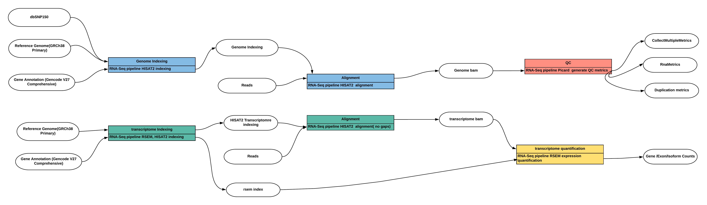

| Pipeline Version | Date Updated | Documentation Author | Questions or Feedback |
| :----: | :---: | :----: | :--------------: |
| [smartseq2_v2.5.0](https://github.com/HumanCellAtlas/skylab/releases/tag/smartseq2_v2.5.0) | November 07, 2019 | [Elizabeth Kiernan](mailto:ekiernan@broadinstitute.org) | Please file GitHub issues in skylab or contact [Kylee Degatano](mailto:kdegatano@broadinstitute.org) |

# Table of Contents

# Smart-Seq2 Pipeline Overview

## Introduction to the Smart-seq2 Pipeline

The Smart-seq 2 pipeline is designed by the [Data Coordination Platform](https://data.humancellatlas.org/about) of the [Human Cell Atlas](https://www.humancellatlas.org/) to process single-cell RNAseq (scRNAseq) data generated by [Smart-seq2 assays](https://www.nature.com/articles/nmeth.2639). The pipeline's workflow is written in WDL, is freely available on [GitHub](https://github.com/HumanCellAtlas/skylab), and can be run by any compliant WDL runner (e.g. [crowmell](https://github.com/broadinstitute/cromwell)). The pipeline is designed to process stranded or un-stranded paired- or single-ended scRNA-seq data. It is an alignment and trascriptome quantification pipeline that can be divided into two flows. First, it aligns reads to the genome and performs quality control on genome-aligned bams. Second, it aligns reads to the transcriptome and generates gene expression estimates from transcriptome-aligned bams. The pipeline returns reads in BAM and an optional Zarr format.

This pipeline has been validated to support both human and mouse datasets.  

## Quick Start Table

| Pipeline Features | Description | Source |
|-------------------|---------------------------------------------------------------|-----------------------|
| Assay Type | Smart-seq2 | [Smart-seq2](https://www.nature.com/articles/nprot.2014.006)
| Overall Workflow  | Quality control module and transcriptome quantification module | Code available from [Github](https://github.com/HumanCellAtlas/skylab/blob/master/pipelines/smartseq2_single_sample/SmartSeq2SingleSample.wdl) |
| Workflow Language | WDL | [openWDL](https://github.com/openwdl/wdl) |
| Genomic Reference Sequence| GRCh38 human genome primary sequence and M21 (GRCm38.p6) mouse genome primary sequence | GENCODE [Human](https://www.gencodegenes.org/human/release_27.html) and [Mouse](https://www.gencodegenes.org/mouse/release_M21.html) 
| Transcriptomic Reference Annotation | V27 GENCODE human transcriptome and M21 mouse transcriptome | GENCODE [Human](ftp://ftp.ebi.ac.uk/pub/databases/gencode/Gencode_human/release_27/gencode.v27.annotation.gtf.gz) and [Mouse](ftp://ftp.ebi.ac.uk/pub/databases/gencode/Gencode_mouse/release_M21/gencode.vM21.annotation.gff3.gz) |
| Aligner  | HISAT2 (v.2.1.0) | [Kim, et al.,2019](https://www.nature.com/articles/s41587-019-0201-4) |
| Transcript Quantification | Utilities for processing large-scale single cell datasets | [RSEM v.1.3.0](https://bmcbioinformatics.biomedcentral.com/articles/10.1186/1471-2105-12-323)                          
| Data Input File Format | File format in which sequencing data is provided | [FASTQ](https://academic.oup.com/nar/article/38/6/1767/3112533) |                     
| Data Output File Format | File formats in which Smart-seq2 output is provided | [BAM](http://samtools.github.io/hts-specs/), [Zarr version 2](https://zarr.readthedocs.io/en/stable/spec/v2.html) (optional output) |

# Set-Up

## Smart-seq2 Installation and Requirements

The Smart-seq2 workflow code can be downloaded by cloning the GitHub repository skylab. For the latest release of Smart-seq2, please see the [release tags prefixed with "Smartseq2"](https://github.com/HumanCellAtlas/skylab/releases).

The workflow is deployed using Cromwell, a GA4GH compliant, flexible workflow management system that supports multiple computing platforms. 

## Inputs

Smart-seq2 sample inputs are found in the [SmartSeq2SingleSampleExample.json](SmartSeq2SingleSampleExample.json) file. 

### Sample data input

The pipeline is designed for both single and paired-end reads in the form of fastq files. The workflow accepts two fastq files for paired-end experiments and one fastq file single-end experiments. The workflow only processes one sample at a time. 

*  fastq1:forward reads for sample with paired-end sequencing (or reads for sample with single-end sequencing)
*  fastq2:reverse reads for sample with paired-end sequencing (not applicable for samples with single-end sequencing)

### Additional Reference Inputs:
*  hisat2_ref_trans_name
*  rrna_intervals: RNA interval file required by Picard
*  hisat2_ref_index: HISAT2 reference index file in tarball
*  genome_ref_fasta: Genome reference in fasta format
*  hisat2_ref_trans_index: HISAT2 transcriptome index file in tarball
*  rsem_ref_index: RSEM reference index file in tarball
*  gene_ref_flat: Gene refflat file required by Picard
*  hisat2_ref_name: HISAT2 reference index name
*  stranded: Library strand information for HISAT2; example values include FR(read corresponds to transcript), RF(read corresponds to reverse compliment of transcript), or NONE
*  sample_name: Sample name or Cell ID
*  output_name: output name, can include path

## Running Smart-seq2

The [SmartSeq2SingleSample.wdl](SmartSeq2SingleSample.wdl) is in the pipelines/optimus folder of the HCA skylab repository and implements the workflow by importing individual modules ("tasks" written in WDL script) from the skylab [Library](https://github.com/HumanCellAtlas/skylab/tree/master/library) folder.

### Smarts-seq2 Modules Summary

Here we describe the modules ("tasks") of the Optimus pipeline; [the code](SmartSeq2SingleSample.wdl) and [library of tasks](https://github.com/HumanCellAtlas/skylab/tree/master/library) are available through GitHub.

Overall, the workflow has two parts:

Part 1: Quality Control Modules
1. Aligns reads to the genome with HISAT2 v.2.1.0
2. Calculates summary metrics from an aligned BAM using Picard

Part 2:Transcriptome Quantification Modules
1. Aligns reads to the transcriptome with HISAT v.2.1.0
2. Quantifies gene expression using RSEM v.1.3.0

## Part 1: Quality Control Modules
### Align reads using HISAT2
HISAT2 accepts paired- or single-ended reads in the form of fastq files. The first step of alignment requires a reference index. HISAT2 can incorporate exons, splice sites and single nucleotide polymorphism (SNP) locations into the index file for alignment. HISAT2 also provides a set of python scripts to build an index using Ensembl or RefSeq annotations. We modify this [script](https://github.com/HumanCellAtlas/skylab/blob/master/docker/hisat2/make_grch38_snp_tran_gencode.sh) to construct an index with the Gencode annotation. The workflow to build the reference index is [here](https://github.com/HumanCellAtlas/skylab/blob/master/pipelines/accessories/build_hisat2_reference/BuilHISAT2Referencebundle.wdl). HISAT2 uses a graph-based alignment and has succeeded HISAT, Tophat2 and Bowtie2. The output of HISAT2 alignment workflow is a bam file.

### Calculate summary metrics using Picard
**[Background]** **Picard** is a set of command line tools (in Java) for manipulating high-throughput sequencing data and also can be used to generate QC reports for RNA-seq.  

Here is a list of QC metrics generated by Picard which are collected in our pipeline:
 * [CollectAlignmentSummaryMetrics](http://broadinstitute.github.io/picard/command-line-overview.html#CollectAlignmentSummaryMetrics)
 * [CollectRnaSeqMetrics](http://broadinstitute.github.io/picard/command-line-overview.html#CollectRnaSeqMetrics)
 * [MarkDuplicates](http://broadinstitute.github.io/picard/command-line-overview.html#MarkDuplicatesWithMateCigar)
 * [CollectInsertSizeMetrics](http://broadinstitute.github.io/picard/command-line-overview.html#CollectInsertSizeMetrics)
 * [CollectGcBiasMetrics](http://broadinstitute.github.io/picard/command-line-overview.html#CollectGcBiasMetrics) 
 * [CollectBaseDistributionByCycle](http://broadinstitute.github.io/picard/command-line-overview.html#CollectBaseDistributionByCycle) 
 * [QualityScoreDistribution](http://broadinstitute.github.io/picard/command-line-overview.html#QualityScoreDistribution) 
 * [MeanQualityByCycle](http://broadinstitute.github.io/picard/command-line-overview.html#MeanQualityByCycle) 
 * [CollectSequencingArtifactMetrics](http://broadinstitute.github.io/picard/command-line-overview.html#CollectSequencingArtifactMetrics) 
 * [CollectQualityYieldMetrics](http://broadinstitute.github.io/picard/command-line-overview.html#CollectQualityYieldMetrics) 

Files needed to run Picard:
 *  Aligned or un-aligned bam files.
Additional files are required for specific metrics:
 *  A reference fasta file.
 *  Ribosomal interval file.
 *  genePred's `refFlat` file. 

## Part 2: SmartSeq2 scRNASeq Quantification
The pipeline uses RSEM to generate expression estimates from the SAM/BAM files generated by HISAT2 alignment of reads against a transcriptome. The **quantification** steps have been incorperated into the SmartSeq2 pipeline.
### Align reads to the transcriptome

### Quantify gene expression using RSEM
The quantification of genes and transcripts is done with the [RSEM](https://deweylab.github.io/RSEM/rsem-calculate-expression.html) program. The program `rsem-calculate-expression` in the RSEM package is used to estimate gene/isoform expression levels. The output can be `expected_counts`, `TPM` or `FPKM`. 

#### Create the RSEM Index
RSEM provides a program to extract and pre-process the reference sequences, then build its index. The workflow to build the RSEM index is available at [Github](https://github.com/HumanCellAtlas/skylab/blob/master/pipelines/accessory_workflows/build_rsem_reference/BuildRsemReferenceBundle.wdl). To learn more about how to build the RSEM index, refer to the [RSEM website](http://deweylab.biostat.wisc.edu/rsem/rsem-prepare-reference.html#description).
**Note** A transcriptome reference Fasta file is included in RSEM index bundle. This file will be used to create the HISAT2 transcriptome index.

## Outputs

## Versioning
