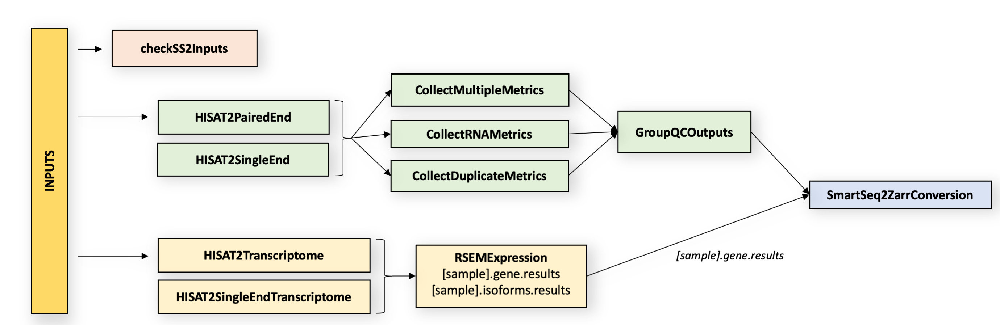

| Pipeline Version | Date Updated | Documentation Author | Questions or Feedback |
| :----: | :---: | :----: | :--------------: |
| [smartseq2_v3.0.0](https://github.com/HumanCellAtlas/skylab/releases/tag/smartseq2_v3.0.0) | December 16, 2019 | [Elizabeth Kiernan](mailto:ekiernan@broadinstitute.org) | Please file GitHub issues in skylab or contact [Kylee Degatano](mailto:kdegatano@broadinstitute.org) |

# Table of Contents
- [Smart-seq2 Single Sample Pipeline Overview](#smart-seq2-single-sample-pipeline-overview)
  * [Introduction to the Smart-seq2 Pipeline](#introduction-to-the-smart-seq2-pipeline)
  * [Quick Start Table](#quick-start-table)
- [Set-Up](#set-up)
  * [Smart-seq2 Installation and Requirements](#smart-seq2-installation-and-requirements)
  * [Inputs](#inputs)
    + [Sample data input](#sample-data-input)
    + [Additional Reference Inputs:](#additional-reference-inputs-)
- [Running Smart-seq2](#running-smart-seq2)
  * [Smart-seq2 Task Summary](#smart-seq2-task-summary)
    + [Part 1: Quality Control Tasks](#part-1-quality-control-tasks)
      - [1.1 Align reads to the genome using HISAT2](#11-align-reads-to-the-genome-using-hisat2)
      - [1.2 Calculate summary metrics using Picard](#12-calculate-summary-metrics-using-picard)
    + [Part 2: Transcriptome Quantification Tasks](#part-2-transcriptome-quantification-tasks)
      - [2.1 Align reads to the transcriptome using HISAT2](#21-align-reads-to-the-transcriptome-using-hisat2)
      - [2.2 Quantify gene expression using RSEM](#22-quantify-gene-expression-using-rsem)
  * [Outputs](#outputs)
- [Versioning](#versioning)
- [Improvements](#have-suggestions)

# Smart-seq2 Single Sample Pipeline Overview

## Introduction to the Smart-seq2 Pipeline

The Smart-seq2 Single Sample pipeline is designed by the [Data Coordination Platform](https://data.humancellatlas.org/about) of the [Human Cell Atlas](https://www.humancellatlas.org/) to process single-cell RNAseq (scRNAseq) data generated by [Smart-seq2 assays](https://www.nature.com/articles/nmeth.2639). The pipeline's workflow is written in WDL, is freely available on [GitHub](https://github.com/HumanCellAtlas/skylab), and can be run by any compliant WDL runner (e.g. [crowmell](https://github.com/broadinstitute/cromwell)). The pipeline is designed to process stranded or unstranded, paired- or single-end, scRNA-seq data from an individual cell (to process multiple cells, see the [smartseq2_multisample](https://github.com/HumanCellAtlas/skylab/tree/master/pipelines/smartseq2_multisample) pipeline). 

The Smart-seq2 Single Sample workflow is divided into two parts which run in parallel. In part one, the workflow aligns reads to the genome and performs quality control on genome-aligned BAMs. In part two, it aligns reads to the transcriptome and generates gene expression estimates from transcriptome-aligned BAMs. The pipeline returns reads and expression estimates in BAM, and read counts and QC metrics in CSV format. An optional Zarr format output is also available.

This pipeline has been validated to support both [human](https://docs.google.com/document/d/1MonsTG8UnROHZ_XpulrSZNTxO988KEH6T6h45plFYQg/edit#heading=h.ixoqmhbabdvh) and [mouse](https://docs.google.com/document/d/12zGTFROrcXEByt9z0h06qjSqb9vWutn28Tx6YiND1Ds/edit) datasets.   

## Quick Start Table

| Pipeline Features | Description | Source |
|-------------------|---------------------------------------------------------------|-----------------------|
| Assay Type | Smart-seq2 Single Sample | [Smart-seq2](https://www.nature.com/articles/nprot.2014.006)
| Overall Workflow  | Quality control and transcriptome quantification | Code available from [Github](https://github.com/HumanCellAtlas/skylab/blob/master/pipelines/smartseq2_single_sample/SmartSeq2SingleSample.wdl) |
| Workflow Language | WDL | [openWDL](https://github.com/openwdl/wdl) |
| Genomic Reference Sequence (for validation)| GRCh38 human genome primary sequence and M21 (GRCm38.p6) mouse genome primary sequence | GENCODE [Human](https://www.gencodegenes.org/human/release_27.html) and [Mouse](https://www.gencodegenes.org/mouse/release_M21.html) 
| Transcriptomic Reference Annotation (for validation) | V27 GENCODE human transcriptome and M21 mouse transcriptome | GENCODE [Human](ftp://ftp.ebi.ac.uk/pub/databases/gencode/Gencode_human/release_27/gencode.v27.annotation.gtf.gz) and [Mouse](ftp://ftp.ebi.ac.uk/pub/databases/gencode/Gencode_mouse/release_M21/gencode.vM21.annotation.gff3.gz) |
| Aligner  | HISAT2 (v.2.1.0) | [Kim, et al.,2019](https://www.nature.com/articles/s41587-019-0201-4) |
| QC Metrics | Picard (v.2.10.10) | [Broad Institute](https://broadinstitute.github.io/picard/)   |
| Transcript Quantification | Utilities for processing large-scale single cell datasets | [RSEM v.1.3.0](https://bmcbioinformatics.biomedcentral.com/articles/10.1186/1471-2105-12-323)                          
| Data Input File Format | File format in which sequencing data is provided | [FASTQ](https://academic.oup.com/nar/article/38/6/1767/3112533) |                     
| Data Output File Formats | File formats in which Smart-seq2 output is provided | [BAM](http://samtools.github.io/hts-specs/), [Zarr version 2](https://zarr.readthedocs.io/en/stable/spec/v2.html) (optional output), CSV (QC Metrics and Counts) |

# Set-Up

## Smart-seq2 Installation and Requirements

The Smart-seq2 workflow code can be downloaded by cloning the GitHub [skylab repository](https://github.com/HumanCellAtlas/skylab). For the latest release of Smart-seq2, please see the [Smart-seq2 Single Sample changelog](SmartSeq2SingleSample.changelog.md).

The workflow is deployed using [Cromwell](https://github.com/broadinstitute/cromwell), a GA4GH compliant, flexible workflow management system that supports multiple computing platforms. 

## Inputs

Example Smart-seq2 Single Sample inputs are found in the [SmartSeq2SingleSampleExample.json](SmartSeq2SingleSampleExample.json) file. 

### Sample data input

The pipeline is designed for both single- and paired-end reads in the form of fastq files. The workflow accepts two fastq files for paired-end experiments and one fastq file single-end experiments. It processes one sample (cell).  

*  fastq1: forward reads for sample with paired-end sequencing (or reads for sample with single-end sequencing)
*  fastq2: reverse reads for sample with paired-end sequencing (not applicable for samples with single-end sequencing)

The workflow will use modified tasks depending if a sample is paired-end or single-end. This is designated with a boolean, as detailed in the following Reference Inputs section.

### Additional Reference Inputs:
The Smart-seq2 Single Sample workflow requires multiple reference indexes. Information on how these indexes are created is found in the [Creating_Smartseq2_References](Creating_Smartseq2_References.md) documentation. The table below describes the references and each tool that uses the reference as input. 

| Workflow Step | Reference name | Reference Description | Tool |
| --- | --- | --- | --- |
| All | sample_name | Sample name or Cell ID | NA |
| All | output_name | Output name, can include path | NA |
| All | paired_end | A boolean describing if sample is paired-end | NA |
| **Genomic alignment with HISAT2** | hisat2_ref_index | HISAT2 reference index file in tarball | HISAT2 |
|     | hisat2_ref_name | HISAT2 reference index name | HISAT2 |
| **Picard-generated Quality Control Metrics** | genome_ref_fasta | Genome reference in fasta format | Picard |
|     | gene_ref_flat | [RefFlat](https://software.broadinstitute.org/software/igv/genePred) file containing the location of RNA transcripts, exon start sites, etc.  | Picard |
|     | rrna_intervals | Ribosomal RNA intervals file | Picard |
|     | stranded | Library strand information for HISAT2; example values include FR (read corresponds to transcript), RF(read corresponds to reverse complement of transcript), or NONE | Picard |
| **Transcriptomic Alignment with HISAT2** | hisat2_ref_trans_index | HISAT2 transcriptome index file in tarball | HISAT2 |
|     | hisat2_ref_trans_name | HISAT2 transcriptome index file name | HISAT2 |
| **Gene Expression Quantification with RSEM** | rsem_ref_index | RSEM reference index file in tarball | RSEM |

# Running Smart-seq2

The [SmartSeq2SingleSample.wdl](SmartSeq2SingleSample.wdl) is in the [pipelines/smartseq2_single_sample folder](https://github.com/HumanCellAtlas/skylab/tree/master/pipelines/smartseq2_single_sample) of the HCA skylab repository and implements the workflow by importing individual tasks (written in WDL script) from the skylab [Library](https://github.com/HumanCellAtlas/skylab/tree/master/library).

## Smart-seq2 Task Summary

Here we describe the tasks of the Smart-seq2 Single Sample pipeline; [the code](SmartSeq2SingleSample.wdl) and [library of tasks](https://github.com/HumanCellAtlas/skylab/tree/master/library) used by the pipeline are available through GitHub. 

Overall, the workflow is divided into two parts that are completed after an initial input validation step.

**Part 1: Quality Control Tasks**
 1. Aligns reads to the genome with HISAT2 v.2.1.0
 2. Calculates summary metrics from an aligned BAM using Picard v.2.10.10

**Part 2: Transcriptome Quantification Tasks**
 1. Aligns reads to the transcriptome with HISAT v.2.1.0
 2. Quantifies gene expression using RSEM v.1.3.0

### Part 1: Quality Control Tasks
#### 1.1 Align reads to the genome using HISAT2
HISAT2 is a fast, cost-efficient alignment tool that can determine the presence of non-transcript sequences and true transcript sequences, taking into account the presence of single-nucleotide polymorphisms ([Kim et al.,2019](https://www.nature.com/articles/s41587-019-0201-4)). The Smart-seq2 Single Sample workflow uses the [HISAT2 task](https://github.com/HumanCellAtlas/skylab/blob/master/library/tasks/HISAT2.wdl) to call HISAT2 and perform graph-based alignment of paired- or single-end reads (in the form of fastq files) to a reference genome. This task  requires a reference index which can be built following the [HCA's build_indices documentation](https://github.com/HumanCellAtlas/skylab/tree/master/library/accessory_workflows/build_indices). The outputs of the task include a genome-aligned BAM file, a BAM index, and an alignment log file. 

#### 1.2 Calculate summary metrics using Picard
[Picard](https://broadinstitute.github.io/picard/) is a suite of command line tools used for manipulating high-throughput sequencing data. The [Picard task](https://github.com/HumanCellAtlas/skylab/blob/master/library/tasks/Picard.wdl) uses Picard tools to calculate quality control measurements on the HISAT2 genome-aligned BAM file. The task requires a reference genome fasta, a RefFlat gene annotation file, and an RNA intervals file (see the [Creating_Smartseq2_References](Creating_Smartseq2_References.md) documentation). The outputs of the task are text and PDF files for each metric.

The [Picard task](https://github.com/HumanCellAtlas/skylab/blob/master/library/tasks/Picard.wdl) generates QC metrics by using three sub-tasks:

*  CollectMultipleMetrics: calls the  [CollectMultipleMetrics](https://software.broadinstitute.org/gatk/documentation/tooldocs/4.0.0.0/picard_analysis_CollectMultipleMetrics.php) tool which uses the aligned BAM file and reference genome fasta to collect metrics on [alignment](http://broadinstitute.github.io/picard/picard-metric-definitions.html#AlignmentSummaryMetrics), [insert size](http://broadinstitute.github.io/picard/picard-metric-definitions.html#InsertSizeMetrics), [GC bias](https://broadinstitute.github.io/picard/command-line-overview.html#CollectGcBiasMetrics), [base distribution by cycle](http://broadinstitute.github.io/picard/picard-metric-definitions.html#BaseDistributionByCycleMetrics), [quality score distribution](https://broadinstitute.github.io/picard/command-line-overview.html#QualityScoreDistribution), [quality distribution by cycle](https://broadinstitute.github.io/picard/command-line-overview.html#MeanQualityByCycle), [sequencing artifacts](http://broadinstitute.github.io/picard/picard-metric-definitions.html#ErrorSummaryMetrics), and [quality yield](http://broadinstitute.github.io/picard/picard-metric-definitions.html#CollectQualityYieldMetrics.QualityYieldMetrics). 

*  CollectRnaMetrics: calls the [CollectRnaSeqMetrics](https://software.broadinstitute.org/gatk/documentation/tooldocs/4.0.0.0/picard_analysis_CollectRnaSeqMetrics.php) tool which uses the aligned BAM, a RefFlat genome annotation file, and a ribosomal intervals file to produce RNA alignment metrics (metric descriptions are found in the [Picard Metrics Dictionary](http://broadinstitute.github.io/picard/picard-metric-definitions.html#RnaSeqMetrics)). 

*  CollectDuplicationMetrics: calls the [MarkDuplicates](https://software.broadinstitute.org/gatk/documentation/tooldocs/4.0.4.0/picard_sam_markduplicates_MarkDuplicates.php) tool which uses the aligned BAM to identify duplicate reads (output metrics are listed in the [Picard Metrics Dictionary](http://broadinstitute.github.io/picard/picard-metric-definitions.html#DuplicationMetrics)).

### Part 2: Transcriptome Quantification Tasks
#### 2.1 Align reads to the transcriptome using HISAT2
The [HISAT2RSEM task](https://github.com/HumanCellAtlas/skylab/blob/master/library/tasks/HISAT2.wdl) uses HISAT2 to align reads to the reference transcriptome. The task requires the hisat2_ref_trans_index file and the sample fastq files as input. The output of this task is a transcriptome-aligned BAM file and an alignment log file.

#### 2.2 Quantify gene expression using RSEM
[RSEM](https://deweylab.github.io/RSEM/README.html#de) is a software package for quantifying transcript abundances ([Li and Dewey, 2011](https://bmcbioinformatics.biomedcentral.com/articles/10.1186/1471-2105-12-323)). The Smart-seq2 Single Sample workflow uses the [RSEM task](https://github.com/HumanCellAtlas/skylab/blob/master/library/tasks/RSEM.wdl) to calculate expression estimates from a transcriptome-aligned BAM file using the rsem_ref_index file for reference input. The RSEM tool [rsem-calculate-expression](http://deweylab.biostat.wisc.edu/rsem/rsem-calculate-expression.html) is used to estimate gene/isoform expression. 

The RSEM task returns the following output files:
*  rsem_gene: gene level expression estimates in FPKM, TPM, and expected counts
*  rsem_isoform: isoform level expression estimates in FPKM, TPM, and expected counts
*  rsem_time: the time consumed by aligning reads 
*  rsem_cnt: alignment statistics
*  rsem_model: RNA-seq model parameters
*  rsem_theta: fraction of reads resulting from background

Only the rsem_gene, rsem_isoform, and rsem_cnt files are used for the final outputs of the Smart-seq2 Single Sample workflow.

After the Smart-seq2 workflow generates HISAT2, Picard and RSEM metrics, the [GroupMetricsOutputs task](https://github.com/HumanCellAtlas/skylab/blob/master/library/tasks/GroupMetricsOutputs.wdl) combines most metrics into a "group_results" CSV file array. The workflow uses this array in downstream Zarr file conversion. The following HISAT2, [Picard](http://broadinstitute.github.io/picard/picard-metric-definitions.html#) and [RSEM](http://deweylab.biostat.wisc.edu/rsem/rsem-calculate-expression.html) outputs are inputs for this task:

*  HISAT2_log_file
*  base_call_dist_metrics
*  gc_bias_detail_metrics
*  pre_adapter_details_metrics
*  pre_adapter_summary_metrics
*  bait_bias_detail_metrics
*  error_summary_metrics
*  alignment_summary_metrics
*  dedup_metrics
*  rna_metrics
*  gc_bias_summary_metrics
*  HISAT2RSEM_log_file
*  RSEMExpression.rsem_cnt

## Outputs
The table below details the final outputs of the Smart-seq2 Single Sample workflow.

| Output Name	|	Output Description |	Output Format |
| --- | --- | --- | 
| Pipeline version | Version of the processing pipeline run on this data | string |
| aligned_bam | HISAT2 out BAM | BAM |
| bam_index | HISAT2 BAM index | BAM |
| insert_size_metrics | Picard insert size metrics | txt |
| quality_distribution_metrics | Picard quality distribution metrics | txt |
| quality_by_cycle_metrics | Picard quality by cycle metrics | txt |
| bait_bias_summary_metrics | Picard bait bias summary metrics | txt |
| rna_metrics | Picard RNA metrics | txt | 
| group_results | Array of Picard metric files generated by the GroupQCOutputs task | CSV |
| rsem_gene_results | RSEM file containing gene-level expression estimates | tab-delimited |
| rsem_isoform_results | RSEM file containing isoform-level expression estimates | tab delimited |
| zarr_output_files | Optional array of output files | Zarr |

The final optional Zarr array includes only the group_results CSV files and the rsem_gene_results.

# Versioning
All Smart-seq2 Single Sample release notes are documented in the [Smartseq2 Single Sample changelog](SmartSeq2SingleSample.changelog.md).

# Have Suggestions?
Coming soon, we will have a GitHub document dedicated to open issues! In the meantime, please help us make our tools better by contacting [Kylee Degatano](mailto:kdegatano@broadinstitute.org) for pipeline-related suggestions or questions.

